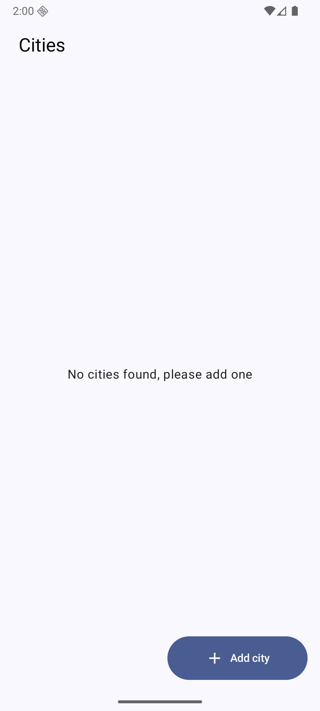
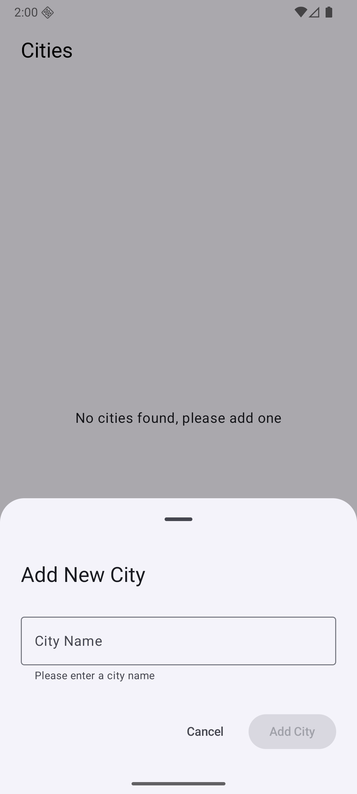
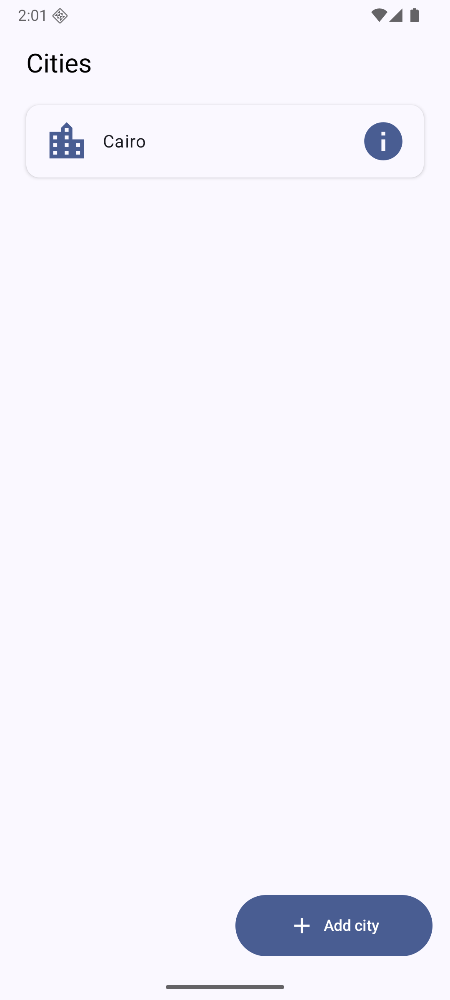
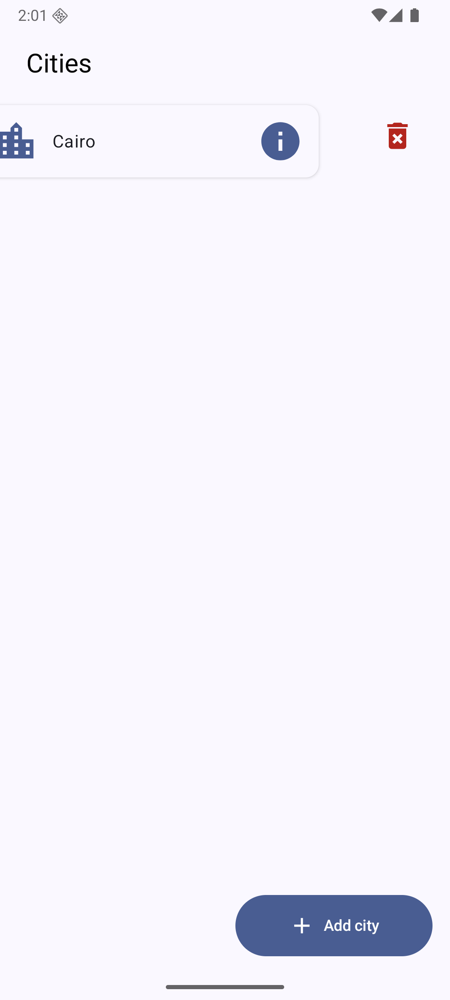
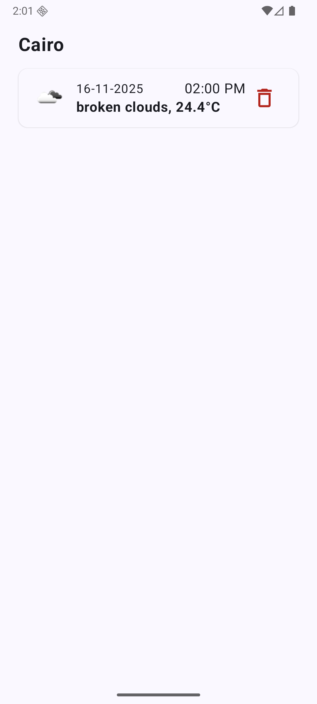
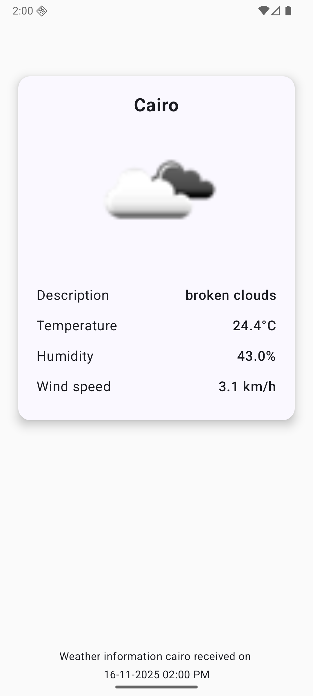
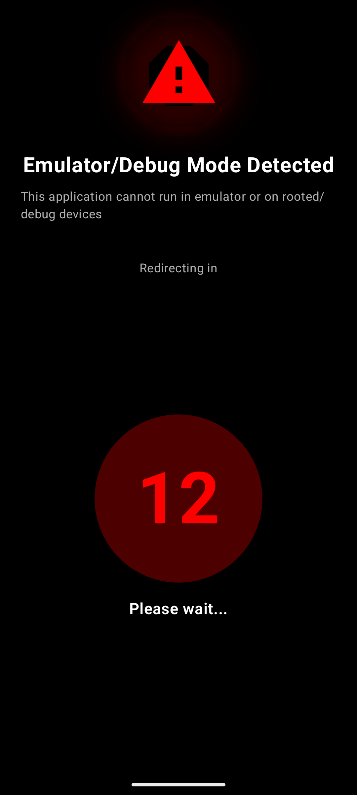
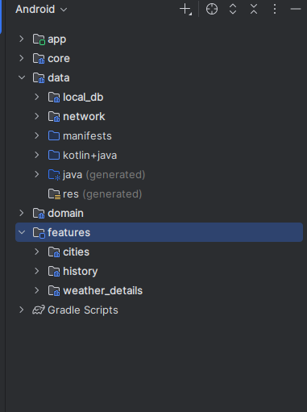

# 🌤️ Plan radar Task (Weather App)

A modern Android application built with **Kotlin** and **Jetpack Compose**, following a **modular MVI
architecture** for scalability, maintainability, and clean separation of concerns.

      
      
      
 
     
      
     

#### 🔒 Security Check
     

---

## 🧩 Tech Stack

- **Kotlin** – Primary language
- **Jetpack Compose** – Declarative and reactive UI
- **Material 3** – Modern design system
- **Hilt** – Dependency Injection
- **Retrofit + OkHttp + Gson** – Networking and JSON parsing
- **Kotlin Coroutines & Flow** – Asynchronous and reactive data handling
- **Room (Database Module)** – Local caching with **offline-first** support
- **Coil** – Image loading
- **JUnit4, MockK, Turbine** – Testing stack

---

## 🧠 Architecture

- Based on **MVI (Model–View–Intent)** for reactive state management.
- Uses a **multi-module architecture**, where each feature and core functionality is separated into
  independent modules for scalability and faster builds.
- Includes a dedicated **`database` module** that provides local data caching through **Room**, supporting an
  **offline-first** experience.
- Follows **clean architecture principles**, separating **UI**, **domain**, and **data** layers clearly.

  

---

## ⚙️ Highlights

- [x] Reactive UI built with **Compose + Flow**
- [x] Scalable **feature-based modular structure**
- [x] **Offline-first** approach using Room and DataStore
- [x] Type-safe networking with **Retrofit + Gson**
- [x] Dependency management with **Hilt**
- [x] Clean, maintainable, and well-documented codebase
- [x]  Security Check for emulator or root detect
- [x]   Built-in **CI/CD** pipeline for continuous integration and testing

